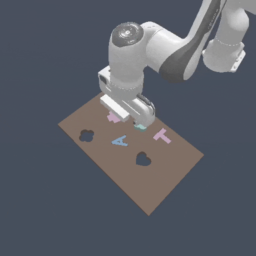

# Transporter Networks

This folder provides a transporter networks baseline to solve the AssemblingKits task.

The original Transporter Networks method has some imprecision that won't be able to solve the more strict ManiSkill2 AssemblingKits environment. As a result, as a more engineered solution this particular baseline does the following

1. Perform an initial scan over the environment, capturing 10 images from the hand-view camera. This is all fused into a single bird-eye view camera and height map. The initial scan is done using the `pd_joint_pos` actions in `qpos_scan_sequence.pkl`
2. Train the Transporter Network on this scanned data, while also predicting a bin of 144 rotations instead of the default 36.
3. During evaluation (e.g in the ManiSkill2 challenge), perform the same initial scan and then predict the pose of the target object and the pose of the goal object (the actions of the TransporterNetwork). A motion planning solution is then used to pick and place according to the predicted poses.

The initial scan + motion planning solution looks as follows:



## Installation

First create a new conda environment and install mani-skill2 and TransporterNetworks 
```
conda create --name ms2tpn python=3.8
conda activate ms2tpn

# clone transporternetworks (called ravens) and install it
git clone https://github.com/google-research/ravens.git
cd ravens
pip install -r requirements.txt
python setup.py install --user

# install an appropriate tensorflow version. 2.11 works
conda install -c conda-forge cudatoolkit=11.2.2 cudnn=8.1.0
export LD_LIBRARY_PATH=$LD_LIBRARY_PATH:$CONDA_PREFIX/lib/
pip install --upgrade pip
pip install tensorflow==2.11.*
pip install tensorflow-addons==0.19.0

pip install mani-skill2
```

Then install pymp, a suite of motion planning tools used for the motion planning portion of this baseline.
```
conda install pinocchio -c defaults -c conda-forge
pip install --upgrade git+https://github.com/Jiayuan-Gu/pymp.git
```

### Evaluation

You can download a pretrained model here https://drive.google.com/file/d/1NgSPeBE8jdDzK6Xj_B38q6PtYa9xjpQD/view?usp=share_link and unzip it to create a folder called `checkpoints`. Otherwise follow [the training section](#training) to learn how to reproduce the pretrained model.

To evaluate the model then run

```
python -m mani_skill2.evaluation.run_evaluation -e "AssemblingKits-v0" -o out --config-file train_episodes.json
```

which uses the local user_solution.py file to solve the AssemblingKits environment, and reports results to a `out` folder. You can add `--record-dir=@` to also record videos to the same folder. The `user_solution.py` file will automatically use the model trained for `100000` steps saved in the above folder.

The config-file train_episodes.json is an example evaluation configuration for local test purposes. The pretrained model after 100,000 training steps should get around a success rate of 14%.

The original TransporterNetworks paper uses a more relaxed requirement for their AssemblingKits environment, to see the success rate of a model using the relaxed requirements see the `out/average_metrics.json` file and check the `pos_correct` and `rot_correct` keys, which is the proportion of evaluation episodes that succesfully positioned and rotated an object to the goal location under relaxed requirements.

### Training 

As our AssemblingKits environment looks different to the ravens environment and is much stricter with success metrics, we provide tools to create a dataset and train a transporter network model from scratch.


#### Generate data
To generate the dataset, first download the demonstrations for AssemblingKits from [Maniskill2](https://github.com/haosulab/Maniskill2). You can run this CLI tool to do so:
```
python -m mani_skill2.utils.download_demo AssemblingKits-v0 -o demos
```

These demonstrations are simply used to generate the initial RGBD images of the assembly kit and the initial and goal poses (the actions of transporter networks)

Once the demos are saved to a local `demos` folder, run the following to generate a training and test dataset

```
python gen_dataset.py --num-procs 8 \
    --traj-name demos/rigid_body/AssemblingKits-v0/trajectory.h5 \
    --json-name demos/rigid_body/AssemblingKits-v0/trajectory.json \
    --output-name data/train_1000.h5 \
    --max-num-traj 1000
python gen_dataset.py --num-procs 8 \
    --traj-name demos/rigid_body/AssemblingKits-v0/trajectory.h5 \
    --json-name demos/rigid_body/AssemblingKits-v0/trajectory.json \
    --output-name data/test_600.h5 \
    --max-num-traj 600 --test-split
```

#### Run training

To run the training code, simply run the following

```
python train.py --task=assembly --agent=transporter --n_demos=1000 --n_rotations=144 
```

which will save checkpoints to `checkpoints/assembly-transporter-1000-0`.

To verify if your training is progressing normally, you can compare training logs on tensorboard with the one in this repo stored in `logs/transporter/assembly/baseline`. The training code here defaults to logging to `logs/transporter/assembly/<auto-generated-name>`, compare by running `tensorboard --logdir logs`.